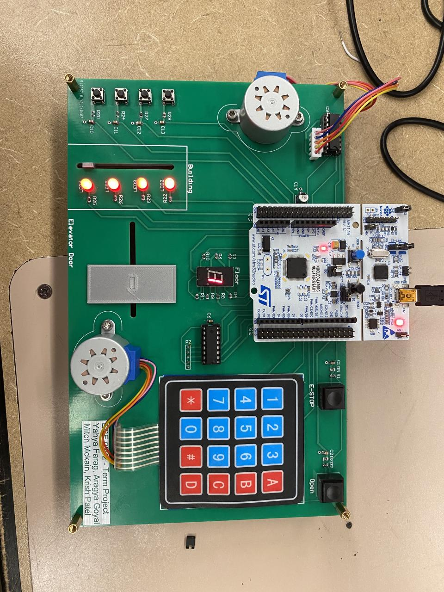

# STM-32 Elevator Simulator Project

This repository contains the code and documentation for an Elevator Simulator PCB project developed for ECE 0202 at the University of Pittsburgh.

The Hardware and Software Write-Up is linked here.  
[Project Write-Up](ECE_0202_TERM_PROJECT.pdf)

The project was developed by Aragya Goyal, Yahya Farag, Mitch McKain, and Krish Patel.
